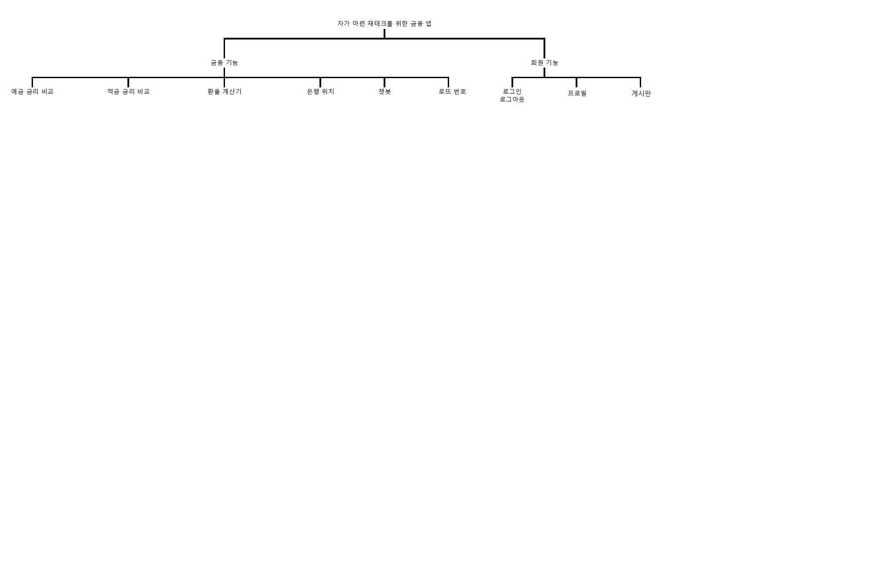
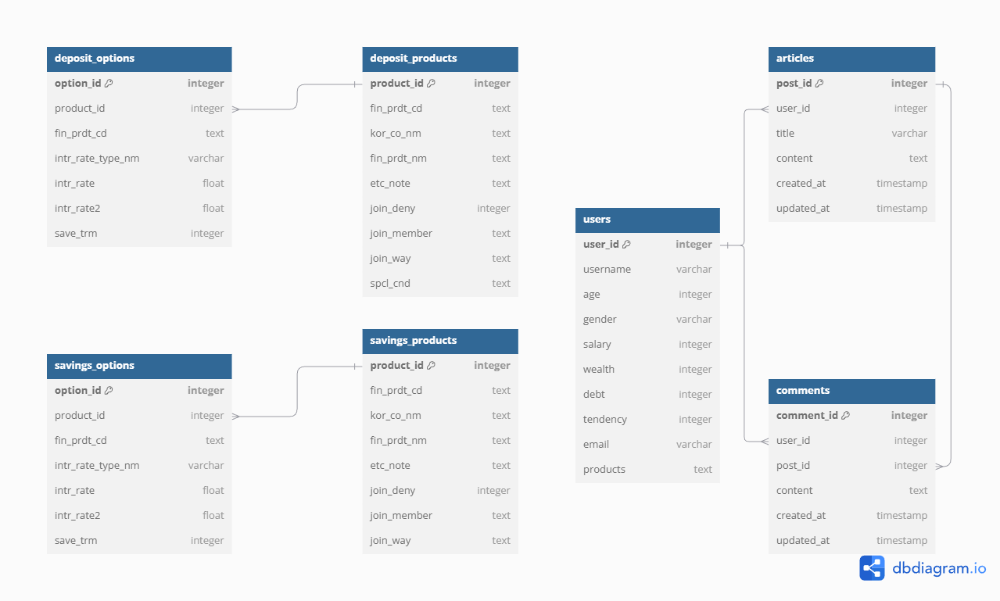

# 1. 팀원 정보 및 업무 분담 내역
기능별 분담 진행
## 1. 이한나 (팀장)
### 1. 예적금 금리 비교 페이지, 상세 페이지 구현
1. 금융상품통합비교공시 API를 back에서 모델로 받음
2. 모델을 통해 데이터 정제
3. 정제된 데이터를 통해 예적금 금리 비교 페이지 구현
4. 상세 페이지 구현
5. 예적금 금리 비교 페이지 검색 기능 추가

### 2. 환율 계산기 구현
1. 한국수출입은행 환율정보 API를 back에서 받아와 vue로 전달
2. 숫자를 input으로 받아 환율 정보를 이용해 환율 계산기 구현
3. button 형식으로 나라 선택 구현

### 3. 카카오맵 API를 활용한 은행 위치 찾기 구현
1. 카카오맵에서 API를 받아와 vue에서 지도 형식으로 나오게 만듦
2. 위치, 은행 이름 input으로 받아 검색 기능 구현

### 4. gpt API를 활용한 챗봇 구현
1. gpt API를 vue에서 js로 받아와 페이지로 연결
2. 예적금 API에서 받아온 정보를 AI에 학습 시켜 예적금 상품 추천 기능 구현

### 5. 로또 번호 추출기 구현
1. vue에서 랜덤으로 6개의 번호 랜덤으로 생성 및 출력

### 6. ERD 모델 제작 및 구현
1. 필요한 기능 정리 후 모델 설계
2. ERD 제작 및 모델 완성

## 2. 정준탁 (팀원)
### 1. 회원가입, 로그인, 로그아웃 구현
1. 장고 유저필드 커스터마이징을 통한 모델 작성
2. 시리얼라이즈.

### 2. 자유게시판 작성, 삭제, 수정 구현
1. 게시글 수정, 삭제 기능 구현(게시글 작성자만 가능)
2. 댓글 작성 기능 구현
3. 댓글 수정, 삭제 기능 구현(댓글 작성자만 가능)

### 3. 프로필 페이지 구현
1. 시리얼라이즈로 받은 데이터 출력
2. 프로필 수정 기능 구현
3. 금융 상품 담기 기능 구현
4. 금융 상품 삭제 기능 구현

### 4. 프론트엔드 작업
1. 환율 계산기, 프로필, 로그인, 회원가입, 챗봇 디자인 수정

# 2. 설계 내용 및 실제 구현 정도
## 1. 설계도

readme1.png 파일 참고
## 2. 구현 정도 - 90%
코인 사이트 API를 통해 코인 차트 분석 페이지를 추가하려고 했으나, 싸피 컴퓨터 IP 주소는 업비트 사이트에 등록이 불가능해 추가할 수 없었다.

# 3. 데이터베이스 모델링 (ERD)

readme2.png 파일 참고

# 4. 금융 상품 추천 알고리즘에 대한 기술적 설명
## 1. 목적
1. 자가 마련을 위해 목돈을 만들려는 사람들에게 적절한 예적금 상품을 추천해주기 위한 챗봇

## 2. 입력 데이터
1. 고객의 나이, 재정 상황, 투자 성향
2. 예적금 상품 정보

## 3. 알고리즘 종류
1. 콘텐츠 기반 필터링
사용자가 입력한 정보를 바탕으로 예적금 상품 정보를 추천해주는 알고리즘

## 4. 알고리즘 설명
1. 사용자가 입력한 정보를 바탕으로 예적금 상품의 만기일 분류
나이가 많을 수록 만기일이 길어야 하고, 재정 상황이 좋을 수록 만기일이 짧아야 하고, 투자 성향이 공격적일 수록 만기일이 짧아야 함.
2. 해당 만기일에서 금리가 높은 상품 3가지 추천

# 5. 서비스 대표 기능들에 대한 설명
## 1. 서비스 대표 기능 설명
### 1. 메인 페이지
1. 주요 기능 링크를 네비게이션 바로 만들어 버튼으로 제공

### 2. 예금 금리 비교 페이지
1. 시중 예금 금리 데이터를 이용해 예금 금리 비교 페이지 구현
2. 은행 및 예치 기간 검색 기능을 통해 사용자가 원하는 조건의 예금 상품 찾기 가능
3. 금융 회사, 금융 상품명, 예치 기간을 표로 제공해 가시성을 높임
4. 상세 페이지에 가입 제한, 가입 대상, 가입 방법, 우대 조건 제공 및 저축 기간에 따라 금리, 우대 금리 비교해 가시성을 높임

### 3. 적금 금리 비교 페이지
1. 시중 적금 금리 데이터를 이용해 적금 금리 비교 페이지 구현
2. 은행 및 예치 기간 검색 기능을 통해 사용자가 원하는 조건의 적금 상품 찾기 가능
3. 금융 회사, 금융 상품명, 예치 기간을 표로 제공해 가시성을 높임
4. 상세 페이지에 가입 제한, 가입 대상, 가입 방법, 우대 조건 제공 및 저축 기간에 따라 금리, 우대 금리 비교해 가시성을 높임

### 4. 환율 계산기 페이지
1. 환율 계산기에 원화 입력창과 나라 선택을 drop down 버튼으로 제공
2. 나라 선택을 하면 환율 정보 및 input에 해당하는 변환 금액 제공

### 5. 은행 위치 페이지
1. 지역 검색 및 은행 검색창에 예시 문장을 placeholder로 제공해 사용자의 편의성 증가
2. 유동 인구가 많은 서울역을 기본 위치로 선정
3. 검색 조건에 맞는 장소에 가까운 순서대로 번호를 붙여 위치를 표시해 사용자가 원하는 정보를 한 눈에 볼 수 있게 만듦
4. 지도 밑에 해당하는 은행 이름, 은행 주소, 은행 전화번호 제공

### 6. 챗봇
1. api로 가져온 금융 상품 정보를 학습 시켜 예적금 금리 비교 사이트에서 확인한 상품들을 최적의 알고리즘으로 추천 받을 수 있음
2. 가시성 좋은 챗봇 디자인을 통해 사용자에게 친숙함을 증가시킴
3. 질문 예시를 통해 사용자가 어떻게 질문하면 좋을지 알려줌
4. 사용자가 물어본 질문에 대한 일반적인 대답, 필요한 팁들을 먼저 알려준 다음 학습한 상품 추천해줌

### 7. 자유게시판
1. 로그인 하지 않은 유저는 게시글 조회만 가능, 상세 정보 조회 가능
2. 로그인 한 유저는 게시글 작성, 댓글 작성 가능하도록 설정
3. 게시글 작성자만 게시글 수정, 삭제 가능하도록 설정
4. 댓글 작성자만 댓글 수정, 삭제 가능하도록 설정

### 8. 프로필 페이지
1. 회원가입 시 입력했던 데이터를(비밀번호 제외) 프로필 페이지에서 조회 가능
2. 이름, 이메일을 제외한 데이터가 수정이 가능하도록 기능 구현
3. 담아둔 금융 상품 조회 가능
3. 프로필에서 금융 상품 삭제 버튼을 누르면 담아둔 상품에서 사라지도록 기능 설정

### 9. 로그인 페이지/회원가입 페이지
1. 로그인 기능 구현
2. 커스텀 유저 모델 사용을 통한 회원가입 기능 구현
3. 금융 상품은 회원가입 시 입력하지 않고, 금융상품에서 선택할 수 있도록 기능 구현

### 10. 로또 번호 생성기
1. '행운 번호 받기'를 통해 6개의 랜덤 번호를 출력해줌
2. 몇 회 추출했는지, 이전에 받은 번호는 무엇인지 표시해서 사용자 편의성 증가
3. 동행복권 사이트 연결 링크를 통해 바로 복권 구매 가능하도록 만듦

# 6. 생성형 AI를 활용한 부분
## 1. 챗봇
1. vue.js에서 gpt api key를 받아와 데이터 입력
2. gpt에 프롬포트 입력을 통해 금융 상품 추천 챗봇을 만듦
3. ChatBoat.vue에서 예적금 금리 데이터를 학습시켜 프롬포트와 함께 대화 내용을 결합해 챗봇에 전달
4. 사용자의 메세지에서 예금, 적금, 서민, 학생과 같은 키워드를 추출해 상품 추천 알고리즘 강화
5. 상품 추천시 상품 유형, 가입 대상, 우대 조건에 대한 정보 제공하도록 만듦

# 7. 기타 (느낀 점, 후기)
## 1. 이한나
### 1. 느낀 점
한 학기 동안 배운 파이썬, 장고, 뷰, 프론트엔드 프레임 워크를 이용해 하나의 웹 페이지를 만들어봤습니다. 따로 배웠던 지식들이 하나의 프로젝트를 통해 유기적으로 결합되는 경험을 할 수 있었습니다. 기억이 안나는 부분은 다시 찾아보기도 하면서 기술들을 확실히 익힐 수 있는 기회였습니다. 팀원과 함께 구현할 기능을 나누고, 소통을 통해 작업을 하면서 협업에 대한 기술도 익힐 수 있었습니다. 혼자 하는 것 보다 함께 할 때 작업 효율이 극대화 되는 것을 느꼈습니다. 서로가 부족한 점은 소통을 통해 공유하며 함께 발전할 수 있는 기회였습니다.

### 2. 개선할 점
코인 API를 가져오지 못한 게 아쉽습니다. 더 많은 API 사이트들을 알아보고, API를 불러오는 연습을 하고 싶습니다. 이후 더 풍성한 홈페이지를 만들고 싶습니다.

## 2. 정준탁
### 1. 부족했던 점
1. 백엔드에서 프론트로 어떻게 데이터가 전달되는 것인지 이해가 부족했음(serialize의 역할, axios의 이해도가 부족했던 점)
2. 다음부터는 뷰에서 Router, counter에 역할에 대해 자세히 파악하고 사용
3. views.py에서 데이터를 전달하는 방식을 더 자세히 파악하고 사용해야 한다.

### 2. 후기
한 학기 동안 배웠던 웹 프레임워크를 사용할 수 있는 좋은 기회였습니다. 설계 시간이 부족해서 많은 시행착오가 있었지만, 저에게 부족한 점이 무엇인지 파악할 수 있는 경험이었습니다. 부족한 부분을 보충한 뒤, 다른 프로젝트를 진행하며 어떤 점을 보완할 수 있는지 생각해보고자 합니다.